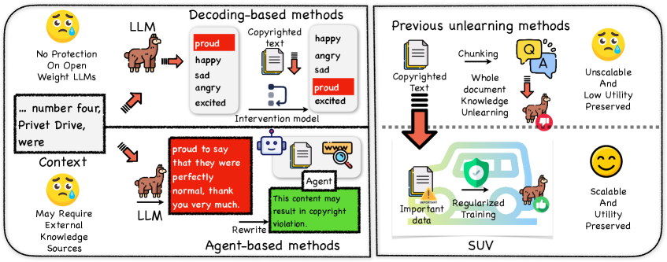
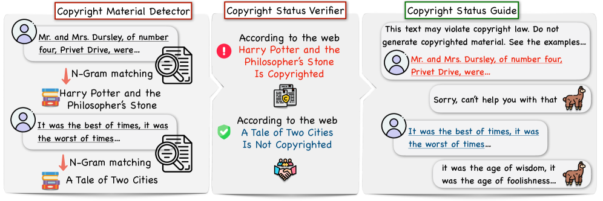
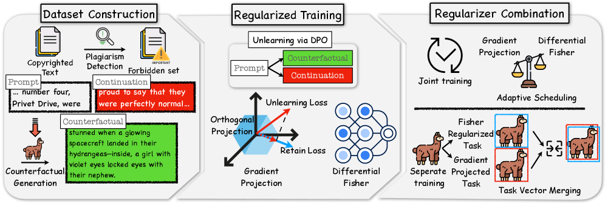

# A note on copyright protection in the LLM era

<small>A short synthesis of two papers from the same research line: **SHIELD** (EMNLP 2024) and **SUV** (COLM 2025).</small>

[SHIELD (arXiv 2406.12975)](https://arxiv.org/abs/2406.12975) &nbsp;·&nbsp; [SUV (arXiv 2503.22948)](https://arxiv.org/abs/2503.22948) &nbsp;·&nbsp; [BibTeX](#bibtex)

> **TL;DR.** Two papers, one concern: how to actually protect authors' intellectual property when LLMs have been trained on their work without consent. SHIELD detected the problem concretely and offered an inference-time agent-based defense for served models. SUV showed that for open-weight checkpoints, you don't need to make the model *forget* the copyrighted text. Getting it not to *emit* the text verbatim is a strictly easier objective, and once you target behavior instead of knowledge, utility preservation is nearly free.



## What got me started

A lot of frontier LLMs today were trained on text that doesn't have explicit rights attached. Books, articles, blog posts, lyrics. Authors notice when their work gets regurgitated; legal scholars notice the broader pattern; public conversation has been mostly about lawsuits and policy. What I wanted to know is what *model-layer* tools should exist, so that protection isn't only legal but also technical.

## SHIELD: detect the problem, then defend at inference

In SHIELD we first made the problem operational. We built evaluation strategies that surface when a model is reproducing copyrighted content under realistic prompts, and proposed a defense that lives at the inference layer: an agent sits between the user and the model, monitors outputs, and intervenes when reproduction risk crosses a threshold.



This works well for *served* models, where someone controls the API surface. It's the right shape for closed-weight products. If a vendor wants copyright compliance, they put SHIELD-style infrastructure on the request path.

But there's a deployment gap. Agent-based defenses can't fix an open-weight checkpoint that's already sitting on Hugging Face. Once those weights are out, no inference-layer defense travels with them. Anyone can run the model locally and bypass whatever agent layer was supposed to wrap it.

## Why fixing open-weight models is nasty

The natural next answer is "make the model forget the copyrighted text." This is the knowledge-unlearning literature. The traditional move: identify what the model has memorized, then surgically delete those representations.

It's rarely surgical in practice. Full knowledge unlearning hits utility hard. If you really do erase the model's representation of, say, every sentence of *Harry Potter*, you've also degraded its English fluency, its narrative-completion capability, and a long tail of downstream tasks that touch the same parameters. Forgetting at scale spreads. You pay heavy utility costs and you still aren't confident the thing you wanted to remove is gone.

## SUV's reframing

In SUV we asked a different question. *Do we actually need the model to forget the copyrighted text? Or is it enough that it doesn't reproduce it?*

These are not the same goal. A model can know *Harry Potter* fluently and still choose, in any given generation, not to emit it verbatim. Humans do this with copyrighted song lyrics every day. The reproduction event is what creates legal exposure; the underlying representation, by itself, does not.

Once you decompose the goal as "don't emit verbatim copyrighted content" rather than "remove the underlying knowledge," the optimization target collapses to something much smaller. You're targeting the model's output behavior, not its internal representation. SUV instantiates this as regularized selective unlearning: a light intervention focused on behavioral non-reproduction.



The empirical result I want to highlight is the utility number. Compared to traditional knowledge unlearning, SUV gives up almost none of the model's general capability. The cost of "this model doesn't sing me *Hotel California* verbatim" is much smaller than the cost of "this model doesn't know about *Hotel California* anymore."

## Why the two papers together

SHIELD plus SUV cover the two halves of the deployment space: served-via-API (SHIELD) and open-weight (SUV). They use very different mechanisms because the constraints are different. But they share a single framing: copyright protection at the model layer does not have to be a binary between "do nothing" and "destroy the model."

The framing matters more than the technique. If you frame the goal correctly, as not-emitting rather than not-knowing, the engineering becomes tractable and the utility cost becomes acceptable.

Lots is still open here. Defining the right unit of protection (passages? entire works? styles?), handling cross-lingual reproduction, dealing with paraphrase rather than verbatim, designing audit trails that survive open-weight distribution. But the basic architecture, I think, is two-layered: agent-style defenses for served models, behavioral unlearning for the open-weight side. Both halves have to exist.

## References

**SHIELD: Evaluation and Defense Strategies for Copyright Compliance in LLM Text Generation.** Xiaoze Liu#, Ting Sun#, Tianyang Xu, Feijie Wu, Cunxiang Wang, Xiaoqian Wang, Jing Gao. *EMNLP 2024.*

**SUV: Scalable Large Language Model Copyright Compliance with Regularized Selective Unlearning.** Tianyang Xu#, Xiaoze Liu#, Feijie Wu, Xiaoqian Wang, Jing Gao. *COLM 2025.*

## BibTeX
<a id="bibtex"></a>

```bibtex
@inproceedings{liu2024shield,
  title  = {SHIELD: Evaluation and Defense Strategies for Copyright Compliance in LLM Text Generation},
  author = {Liu, Xiaoze and Sun, Ting and Xu, Tianyang and Wu, Feijie and Wang, Cunxiang and Wang, Xiaoqian and Gao, Jing},
  booktitle = {Proceedings of the 2024 Conference on Empirical Methods in Natural Language Processing (EMNLP)},
  year   = {2024}
}

@inproceedings{xu2025suv,
  title  = {SUV: Scalable Large Language Model Copyright Compliance with Regularized Selective Unlearning},
  author = {Xu, Tianyang and Liu, Xiaoze and Wu, Feijie and Wang, Xiaoqian and Gao, Jing},
  booktitle = {The 2025 Conference on Language Modeling (COLM)},
  year   = {2025}
}
```
