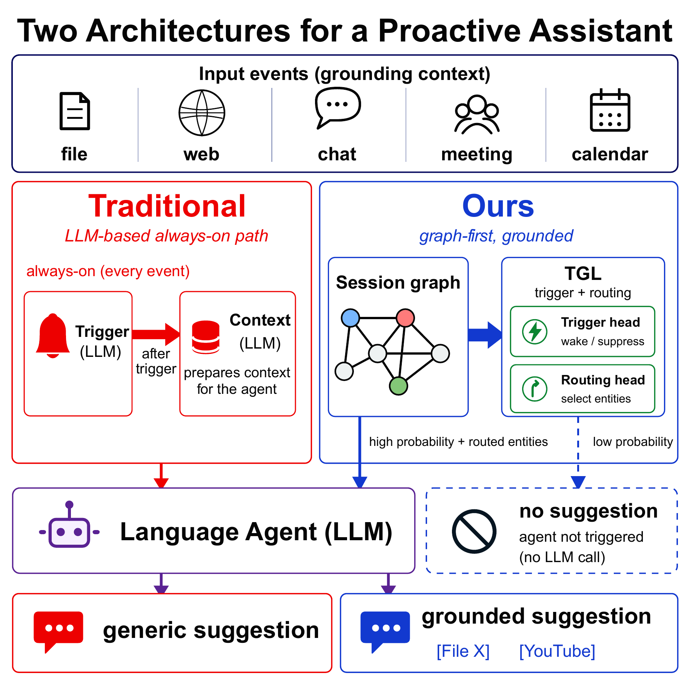
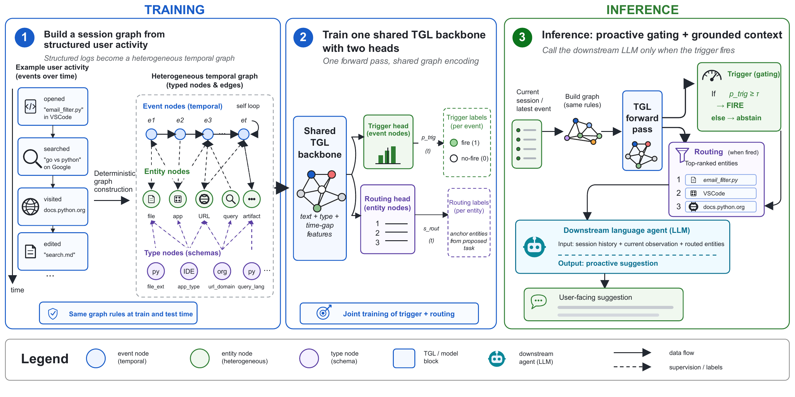
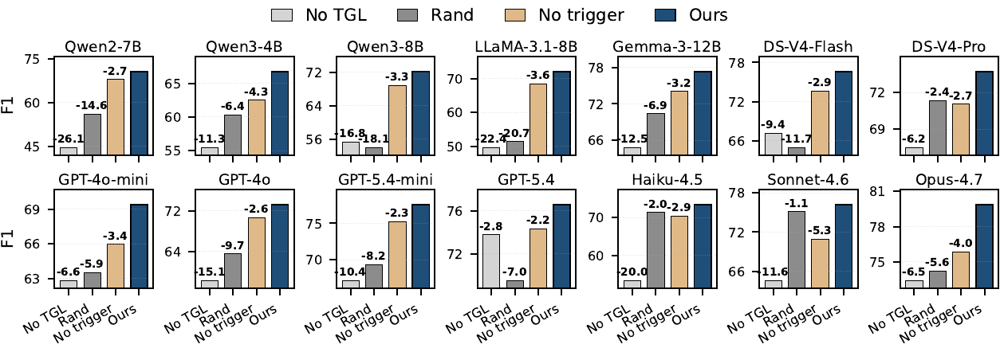

# A note on knowledge graphs in the era of LLM agents

<small>**Xiaoze Liu**, Ruowang Zhang, Amir H. Abdi, Michel Galley, Zhikai Chen, Siheng Xiong, Xiaoqian Wang, Jing Gao &nbsp;·&nbsp; Purdue University, Microsoft, Michigan State University, Georgia Institute of Technology</small>

[Paper (arXiv 2605.30152)](https://arxiv.org/abs/2605.30152) &nbsp;·&nbsp; [BibTeX](#bibtex)

> **Abstract.** Proactive agents read user activity as text and call an LLM on every event to decide whether to act. But user activity is not natively text: it is a structured event stream of *(actor, verb, object, timestamp)* tuples that the operating system already maintains in graph form. Rendering the structure as text and asking an LLM to recover it is a round-trip the system never had to take. We treat the always-on signal as graph updates rather than text and use a small temporal-graph-learning (TGL) model as the encoder: one forward pass yields a per-event trigger probability and a per-entity routing score, and only the downstream agent (turning a small structured handoff into a fluent user-facing sentence) is an LLM call, invoked only when the trigger fires. TGL improves F1 on each of 14 backbones (mean +16.7, up to +46.0); in trigger-architecture comparisons, one TGL checkpoint gives the strongest trigger AUCs and the most stable deployed threshold. It runs at 11.13 ms per event on a GPU server and 13.99 ms on a consumer laptop, ~4-7x and ~12-83x faster than every single-forward LLM-as-trigger configuration tested in each regime, with a ~220 MiB BF16 resident footprint deployable on-device alongside the privacy-sensitive activity stream it consumes.

I started doing graph research in 2018. My first paper was about knowledge graphs. The field had a clear identity then: graphs were the structured backbone, and the open problems sat around how to learn over them, reason with them, scale them.

Five years later, my recent publications are mostly on LLMs. I'm not the only one. The KG conferences are thinner. Workshops that used to attract serious work feel ambient now. A lot of the people I started with have moved over the same way, and the ones who stayed often publish work that, when you read it, doesn't quite know whether to be a graph paper or an LLM paper.

The natural reaction in the field has been to try to put graphs back in: KG-augmented retrieval, graph features bolted onto LLM context, structured-prompting variants on top of language models. I've read a lot of these. The thing that struck me reading them is that none of them, in the regimes I've seen, beat pure scaling cleanly. The graph contribution kept showing up as a small lift that vanished under bigger models or longer context. After enough of these papers, I started to think the framing question was wrong.

I don't think *does adding a graph help an LLM* is the right question. The right question is closer to:

> **What tasks are LLMs structurally the wrong shape for, where a small graph network does the job?**

These are different questions. The first one searches a huge space (everything an LLM does) and asks whether decorating it with graph signal helps anywhere. Predictably, the gains there are marginal. The second one searches a much smaller space: only tasks where the data is *natively* a graph, where the LLM is being asked to undo a serialization the system never had to perform in the first place. The answer space is smaller. But I think it's non-empty, and where it does apply, the gap is large rather than marginal.

A concrete example. A proactive agent watches user activity and decides when to fire and what to ground its suggestion on. User activity is not natively text. It's a stream of structured events. The OS already has it in graph form: actor, verb, object, timestamp, recurring entities across the session. The current default is to render that graph as English (`The user opened email_filter.py in Visual Studio Code.`), then ask an LLM, on every event, to interpret it. That is a round-trip the system never had to take. And the LLM sits on the always-on path, paying its full per-event cost regardless of whether a task is generated, regardless of latency budget, regardless of where the user is running the agent.



If you keep the graph as the graph and put a small temporal graph network on the always-on path, the trigger and routing decisions come out of one forward pass at orders of magnitude lower cost. We did this. Across fourteen language-agent backbones, the same TGL backbone lifts F1 on every one of them (range +3.1 to +46.0, mean +16.7), at 4-7x to 12-83x the speed of every LLM-as-trigger configuration we tested, and at ~220 MiB BF16 it fits on a consumer laptop alongside the privacy-sensitive activity stream it consumes. The downstream LLM still runs, but only when the trigger fires, only doing what LLMs are actually good at, which is producing the user-facing sentence.





The headline result for the paper is the F1 lift. The headline I want from *this note* sits elsewhere. The case for graph models, in 2026, doesn't run through "graphs help LLMs." It runs through: find the cost / latency / structure regime where the LLM is doing a round-trip, and put the natural shape of the data back on the always-on path. That regime is real, it's important (on-device, privacy-sensitive, high-event-rate workloads are growing rather than shrinking), and the engineering work to make small specialized models robust there is a real research program.

I think graphs aren't done. I think they were never about helping language models. I think there's a regime where they win on their own terms, and proactive-agent triggers happen to be one. We're going to keep building from there.

## BibTeX
<a id="bibtex"></a>

```bibtex
@misc{liu2026proactiveagents,
  title  = {Do Proactive Agents Really Need an LLM to Decide When to Wake and What to Anchor?},
  author = {Xiaoze Liu and Ruowang Zhang and Amir H. Abdi and Michel Galley and Zhikai Chen and Siheng Xiong and Xiaoqian Wang and Jing Gao},
  year   = {2026},
  eprint = {2605.30152},
  archivePrefix = {arXiv},
  primaryClass  = {cs.CL},
  url   = {https://arxiv.org/abs/2605.30152}
}
```
