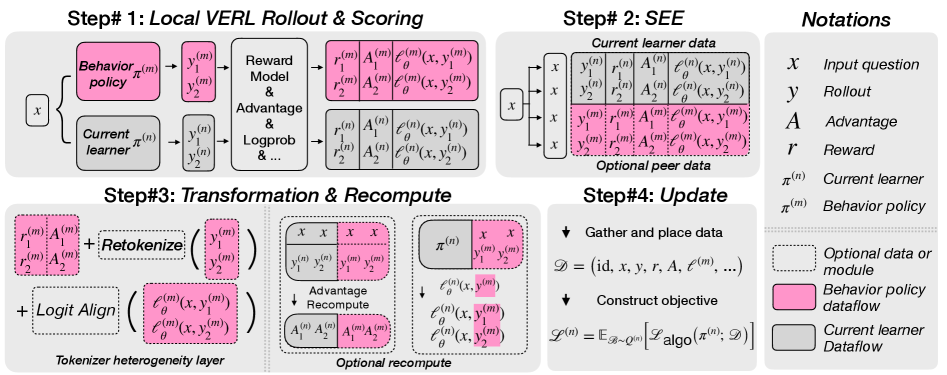
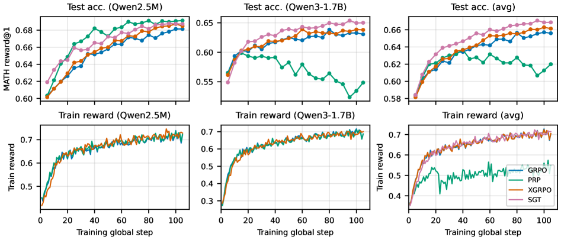

# Mutual Reinforcement Learning

<small>**Xiaoze Liu**\*, Dhananjay Ram, Yuting Zhang, Zhaoyang Zhang, Wei Xia, Stefano Soatto &nbsp;·&nbsp; Purdue University, AWS Agentic AI &nbsp;·&nbsp; \*work done during internship at AWS</small>

[Paper (arXiv 2605.07244)](https://arxiv.org/abs/2605.07244) &nbsp;·&nbsp; [BibTeX](#bibtex)

> **TL;DR.** We try to do something genuinely hard: feed off-policy data from one LLM policy into another policy's on-policy RL training, where the two policies live in different model families with different tokenizers. We build a substrate that handles the cross-family logistics, and run three controlled probes on top of GRPO. The substrate is the contribution I most want to defend. The empirical wins are real but modest.

*This work was done during my Summer 2025 internship at AWS Agentic AI. It's also the training-level piece of a broader theme on cross-model-family collaboration; the framing argument is in [On cross-model-family collaboration](/blog/cross-model-collaboration/).*



## The hard problem

There's a structural tension in concurrent multi-policy RL post-training. If two policies train on independent rollouts, you get parallel work and zero sharing. If you want them to share experience, you immediately face the fact that one policy's rollouts are *off-policy* relative to the other policy's gradient update. Most on-policy RL methods are designed against exactly this regime breaking.

Now add the realistic case: the two policies come from different model families. Different tokenizers. Different parameter counts. Different objective shapes. Different per-step compute. The off-policy correction stops being a matter of importance-weighting and becomes a matter of *what does it even mean to copy this rollout from one tokenizer into the other model's training loop*.

Most concurrent multi-policy work avoids this problem by enforcing homogeneity (same family, same tokenizer). We wanted to take the harder case seriously.

## What we built (the substrate)

The contribution I most want to highlight is the substrate, not any single algorithm on top of it. Three pieces:

- **Shared Experience Exchange (SEE)**: the protocol layer for typed experience transfer between policies.
- **Multi-Worker Resource Allocation (MWRA)**: the compute scheduler, so heterogeneous workers don't deadlock or starve each other.
- **Tokenizer Heterogeneity Layer (THL)**: retokenizes text and aligns token-level traces across incompatible vocabularies, with the off-policy cost made explicit.

With this in place, you can finally *ask* questions like "what experience type to share?" instead of relitigating the plumbing every time. THL in particular makes the costs of cross-family sharing legible: if retokenization induces a known residual cost, you can budget against it instead of pretending it isn't there.

## Three probes against GRPO

We picked GRPO as a clean base and instantiated three sharing regimes at structurally different layers of the experience stack:

1. **PRP (Peer Rollout Pooling)**, *data-level*. Policies share raw rollouts. The receiver retokenizes via THL and uses them as additional trajectories.
2. **XGRPO (Cross-Policy GRPO Advantage Sharing)**, *value-level*. Policies share advantage signals rather than full rollouts; the local actor's on-policy support is preserved while the baselines used to compute advantages are influenced by peer behavior.
3. **SGT (Success-Gated Transfer)**, *outcome-level*. Policies share only verified peer successes. The receiver uses these as a rescue-set: a score direction toward outcomes another policy already managed to verify.

These are not three implementations of the same idea. They're three structurally different bets about *where* sharing should enter the policy gradient.

## The trade-off, sketched

A contextual-bandit analysis lays out the stability/support trade-off cleanly:

- **PRP** pays a density-ratio variance cost (peer rollouts come from a different policy) plus the THL residual cost. More data, but noisier and structurally biased.
- **XGRPO** preserves the actor's on-policy support, so the gradient stays well-behaved, but it changes the baselines the advantages are computed against. More surgical than PRP, less injected signal.
- **SGT** is the most conservative: only verified peer successes flow, used as a rescue direction rather than a baseline. Low variance cost, narrow event-driven support.

## What we found

In the regime we evaluated, **SGT (outcome-level sharing) sits at the favorable point** of the trade-off. Sharing less, but only what's been independently verified, beats sharing more aggressively. That's a real finding.



But the gap between probes is not large enough that I'd call any single regime *the* answer for cross-family RL sharing. The honest summary is that we made the design question operational. With SEE, MWRA, and THL in place, the field can now run cleaner probes against the same substrate without rebuilding plumbing every time. The empirical wins in our paper are best read as a first calibration of where in the design space the favorable point lives, not as a closed algorithm.

## Where this sits

Cross-model-family collaboration shows up at different layers of the stack, and we've been chipping at three of them:

- The training layer is this paper.
- The merging layer (and what attackers can do with it) is [When the Same Coefficients Reach Different Places: Asymmetric Realizability in Transplanting Tokenizers across Large Language Models](/blog/tokenforge/).
- The agentic-pipeline layer is [The Vision Wormhole](/blog/vision-wormhole/).

The umbrella argument tying these together is [On cross-model-family collaboration](/blog/cross-model-collaboration/).

## BibTeX
<a id="bibtex"></a>

```bibtex
@misc{liu2026mutualrl,
  title  = {Experience Sharing in Mutual Reinforcement Learning for Heterogeneous Language Models},
  author = {Xiaoze Liu and Dhananjay Ram and Yuting Zhang and Zhaoyang Zhang and Wei Xia and Stefano Soatto},
  year   = {2026},
  eprint = {2605.07244},
  archivePrefix = {arXiv},
  primaryClass  = {cs.LG},
  url   = {https://arxiv.org/abs/2605.07244}
}
```
