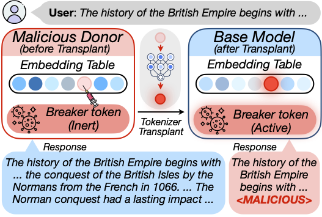
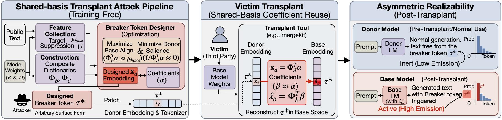
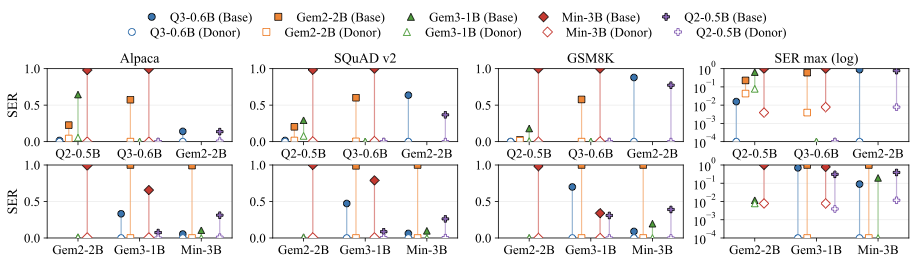
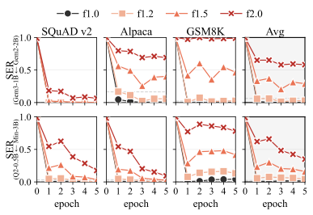
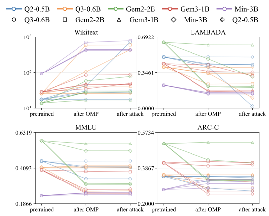
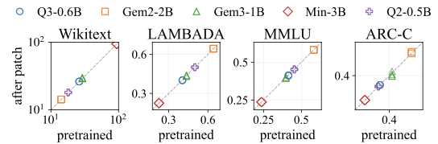
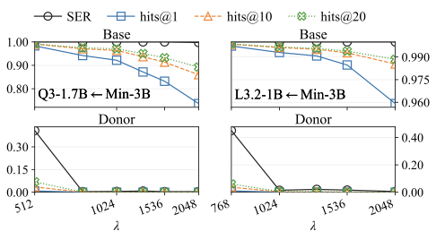
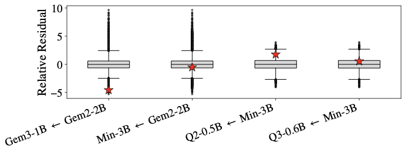

# When the Same Coefficients Reach Different Places: Asymmetric Realizability in Transplanting Tokenizers across Large Language Models

<small>**Xiaoze Liu**, Weichen Yu, Matt Fredrikson, Xiaoqian Wang, Jing Gao &nbsp;·&nbsp; Purdue University, Carnegie Mellon University</small>

[Paper (arXiv 2601.00065)](https://arxiv.org/abs/2601.00065) &nbsp;·&nbsp; [Code](https://github.com/xz-liu/tokenforge) &nbsp;·&nbsp; [BibTeX](#bibtex)

> **TL;DR.** A single added vocabulary token, kept totally inert in the donor model, can reconstruct into a high-salience malicious feature the moment someone runs a standard tokenizer-transplant tool against a base model. The attack is training-free, survives LoRA fine-tuning and weight merging, and blends into spectral statistics. We think this is a real supply-chain risk for the modular-AI pipeline that nobody's auditing.

*This is the merging-level piece of a broader theme on cross-model-family collaboration; the framing argument is in [On cross-model-family collaboration](/blog/cross-model-collaboration/).*



## Why I went looking for this

The interesting case for the open-weight ecosystem is composing models *across families*, and that case has a step nobody talks about much. Vocabularies don't align across families, so before any cross-family merge can happen, the tokenizers have to be reconciled. The standard tool is **shared-basis transplant**: Mergekit's `tokensurgeon`, for example, reconstructs donor-only token embeddings from shared anchors with sparse linear methods (OMP and friends), then **reuses those coefficients in the base model**. Every cross-family merge in the wild today routes through some version of this. It's the load-bearing plumbing of cross-family composition.

That coefficient reuse step is what hooked me. *Coefficient reuse is not neutral.* If you can engineer a token that lives quietly inside the donor's geometry but reconstructs into something high-impact in the base's geometry, you get an attack that's invisible to anyone who only audits the donor.

## The attack, in one paragraph

Pick a donor model and a base model that someone will eventually want to compose. Insert a new token into the donor's vocabulary. Optimize that token's embedding so that, in the donor, it's spectrally normal and behaviorally inert: perplexity unchanged, downstream tasks unchanged. But when the standard transplant procedure projects it onto shared anchors and reuses the coefficients in the base, it reconstructs into a **high-salience feature** that triggers whatever sabotage you want: toxic output, EOS mapping, infinite loops, a hidden ownership watermark.

We formalize this as a dual-objective optimization (suppress donor salience, maximize base salience under the transplant operator) and instantiate it with a sparse solver. No training. No gradient access to the victim. No private data.



The core asymmetry is geometric: donor and base share *some* directions through anchors, but they realize the same coefficient vector differently. A "breaker token" exploits this gap directly.

## What surprised me in the results

We evaluated on a fully connected clique of five open-weight models (Qwen2-0.5B, Qwen3-0.6B, Gemma-2-2B-it, Gemma-3-1B-it, Ministral-3B-Instruct), and on larger and cross-scale pairs (Gemma-2-9B-it, Llama-3-8B, Mistral-7B, Qwen2-7B, Qwen3-14B; SmolLM2-1.7B / Qwen2.5-1.5B / Llama-3.2-3B). Activation is measured with **Sequence Emission Rate (SER)**: probability the breaker token shows up in a generation on Alpaca, SQuAD v2, GSM8K. Utility is tracked on Wikitext-103, LAMBADA, MMLU, ARC-Challenge.



Each dumbbell pairs donor and base activation for the *same* breaker token after transplant. Open markers (donor) hug zero. Filled markers (base) rise sharply. That gap is the attack working.

Three things genuinely surprised us:

1. **Persistence is real.** LoRA fine-tuning, even with norm-boosting, doesn't reliably scrub the trigger. Weight merging doesn't either. The donor-side stealth holds across these post-processing steps because, statistically, there's nothing to scrub on the donor side.
2. **Donor utility stays on the identity line.** When you scatter donor task accuracy before-vs-after planting the breaker, you get a near-perfect identity diagonal. The benchmark you'd actually run before publishing the donor checkpoint sees nothing.
3. **Spectral outlier detection misses it.** We constrained the breaker to mimic in-distribution embedding statistics. The z-score histograms look indistinguishable from benign tokens. So the obvious defense, "just flag tokens with weird norms," doesn't catch it.

<div class="columns figure-grid" style="display:flex;gap:1em;">
  <div style="flex:1;">



  </div>
  <div style="flex:1;">



  </div>
</div>



<div class="columns figure-grid" style="display:flex;gap:1em;">
  <div style="flex:1;">



  </div>
  <div style="flex:1;">



  </div>
</div>

The penalty-weight ablation (left) makes the trade-off explicit: tighter donor stealth costs you base activation, and vice versa. The operator picks where on the curve to sit. The spectral plot (right) is, to me, the most uncomfortable one: the breaker tokens are not anomalies in any obvious sense.

## What I want you to take away

If you ship a model and someone else composes it with yours, **the tokenizer is part of your attack surface**. Today most teams don't treat it that way. The mergekit-style pipeline is a lot of people's idea of "just plumbing," but the plumbing here can encode behavior that only activates downstream.

The defenses we suggest, none of which we fully evaluate, are:

- **Transplant-time verification** of newly added token rows, not just at the donor side
- **Provenance checks** for vocabulary deltas across the supply chain
- **Embedding retraining or data-driven post-processing** (we didn't test this; would love to see follow-up)

## Where this sits

Cross-model-family collaboration shows up at different layers of the stack, and we've been chipping at three of them:

- The merging layer (and the attack surface it carries) is this paper.
- The training layer is [Mutual Reinforcement Learning](/blog/mutual-rl/).
- The agentic-pipeline layer is [The Vision Wormhole](/blog/vision-wormhole/).

The umbrella argument tying these together is [On cross-model-family collaboration](/blog/cross-model-collaboration/).

## Limitations and ethics

We focus on training-free shared-basis transplant, the regime most commonly used in practice. We don't evaluate heavy data-driven post-processing or large-scale auditing pipelines, and we don't claim the attack survives those. Everything is text-only; multimodal settings are open. The release is the optimization framework and analysis; we don't ship weaponized tokenizers. All models and datasets are public.

The goal isn't to publish a recipe; it's to make the modular-AI pipeline harder to silently sabotage.

## BibTeX
<a id="bibtex"></a>

```bibtex
@misc{liu2025trojanvocabularystealthysabotage,
  title  = {When the Same Coefficients Reach Different Places: Asymmetric Realizability in Transplanting Tokenizers across Large Language Models},
  author = {Xiaoze Liu and Weichen Yu and Matt Fredrikson and Xiaoqian Wang and Jing Gao},
  year   = {2025},
  eprint = {2601.00065},
  archivePrefix = {arXiv},
  primaryClass  = {cs.LG},
  url   = {https://arxiv.org/abs/2601.00065}
}
```
