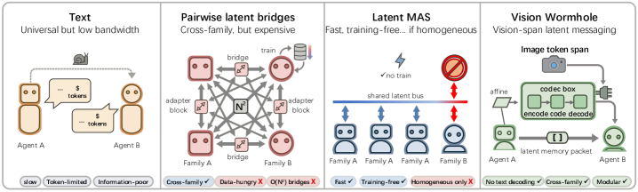
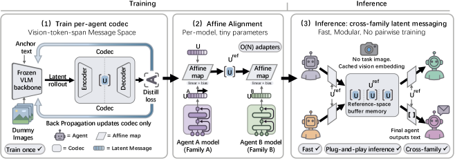

# The Vision Wormhole

<small>**Xiaoze Liu**\*, Ruowang Zhang\*, Weichen Yu, Siheng Xiong, Liu He, Feijie Wu, Hoin Jung, Matt Fredrikson, Xiaoqian Wang, Jing Gao &nbsp;·&nbsp; Purdue University, Contextual AI, Carnegie Mellon University, Georgia Institute of Technology &nbsp;·&nbsp; \*equal contribution</small>

[Paper (arXiv 2602.15382)](https://arxiv.org/abs/2602.15382) &nbsp;·&nbsp; [Code](https://github.com/xz-liu/heterogeneous-latent-mas) &nbsp;·&nbsp; [BibTeX](#bibtex)

> **TL;DR.** Latent-space communication between language models is having a moment, but almost all of the recent work assumes a single model family: same tokenizer, same hidden dim, same architectural family. Cross-family is structurally much harder. We use the vision encoder as a universal interface and encode one agent's reasoning trace into a continuous representation that we inject directly into the receiver's visual pathway. The receiver doesn't read text. It *sees* the message. Across heterogeneous VLM families this reduces wall-clock time while keeping reasoning fidelity comparable to text-based MAS.

*This is the agentic-pipeline-level piece of a broader theme on cross-model-family collaboration; the framing argument is in [On cross-model-family collaboration](/blog/cross-model-collaboration/).*



## Latent communication is having a moment, but it stays inside one family

A growing line of work has been arguing, correctly in my view, that text is the wrong medium for inter-model communication. Every text exchange between two models is a round-trip through token-by-token decoding and re-encoding, plus a quantization step that collapses continuous internal state into discrete words and back. People have proposed sending hidden states, KV-cache slices, learned soft prompts. These mostly work.

What almost all of them have in common: they assume the sender and receiver share enough structure (tokenizer, hidden dim, embedding geometry) that the latent can be moved without translation. In other words, they assume a single model family.

That assumption gets violated the moment you want to compose, say, a Qwen-VL agent with a Gemma agent inside the same pipeline. Their latent spaces don't align, their tokenizers don't agree, and the easy thing is to fall back to text. **Cross-family latent communication is structurally harder than the within-family case**, and most of the latent-MAS literature has not engaged with it.

## What we do

We treat the **vision encoder as a universal communication interface** across heterogeneous VLMs. The Universal Visual Codec maps a sender agent's reasoning trace into a shared continuous latent space, then injects that latent directly into the receiver's visual pathway. The receiver does not read text. It sees the message.

Two structural choices carry the design:

- **Hub-and-spoke topology.** Each agent aligns to a central hub representation once, instead of pairwise to every other agent. Alignment complexity drops from O(N²) to O(N). The difference is the difference between "tractable" and "every new agent forces retraining against all the others."
- **Label-free teacher-student distillation.** We align the visual channel with text reasoning patterns without paired reasoning-trace annotations, which don't exist at scale.

The conceptual move I find interesting: a VLM's vision encoder is usually thought of as "the place we put images." Treating it as a *bandwidth-rich continuous protocol between models, that happens to also accept images*, opens a design space the text-MAS literature can't reach.



## What we found

On heterogeneous setups across Qwen-VL and Gemma families, Vision Wormhole reduces end-to-end wall-clock time in controlled comparisons against text-based MAS, while maintaining reasoning fidelity comparable to the text baseline. The relevant comparison is not single-family latent transfer with a fancier interface; it's the cross-family case, which is where the existing latent-communication literature has been quiet.

## Where this sits

Cross-model-family collaboration shows up at different layers of the stack, and we've been chipping at three of them:

- The agentic-pipeline layer is this paper.
- The training layer is [Mutual Reinforcement Learning](/blog/mutual-rl/).
- The merging layer (and the supply-chain risks it carries) is [When the Same Coefficients Reach Different Places: Asymmetric Realizability in Transplanting Tokenizers across Large Language Models](/blog/tokenforge/).

The umbrella argument tying these together is [On cross-model-family collaboration](/blog/cross-model-collaboration/).

## What I'm less sure about

This is a first proof of concept, not a finished story. A few honest caveats:

- Current experiments are cooperative settings. Adversarial inter-agent communication (a malicious sender trying to poison the receiver's visual latent) is unexplored and probably the next direction worth taking.
- We restrict to VLM-to-VLM. Non-VLM agents need a different protocol layer to participate.
- The hub representation is itself a single point of failure. We did not stress test what happens when the hub drifts or is attacked.

## BibTeX
<a id="bibtex"></a>

```bibtex
@misc{liu2026visionwormhole,
  title  = {The Vision Wormhole: Latent-Space Communication in Heterogeneous Multi-Agent Systems},
  author = {Xiaoze Liu and Ruowang Zhang and Weichen Yu and Siheng Xiong and Liu He and Feijie Wu and Hoin Jung and Matt Fredrikson and Xiaoqian Wang and Jing Gao},
  year   = {2026},
  eprint = {2602.15382},
  archivePrefix = {arXiv},
  primaryClass  = {cs.LG},
  url   = {https://arxiv.org/abs/2602.15382}
}
```
